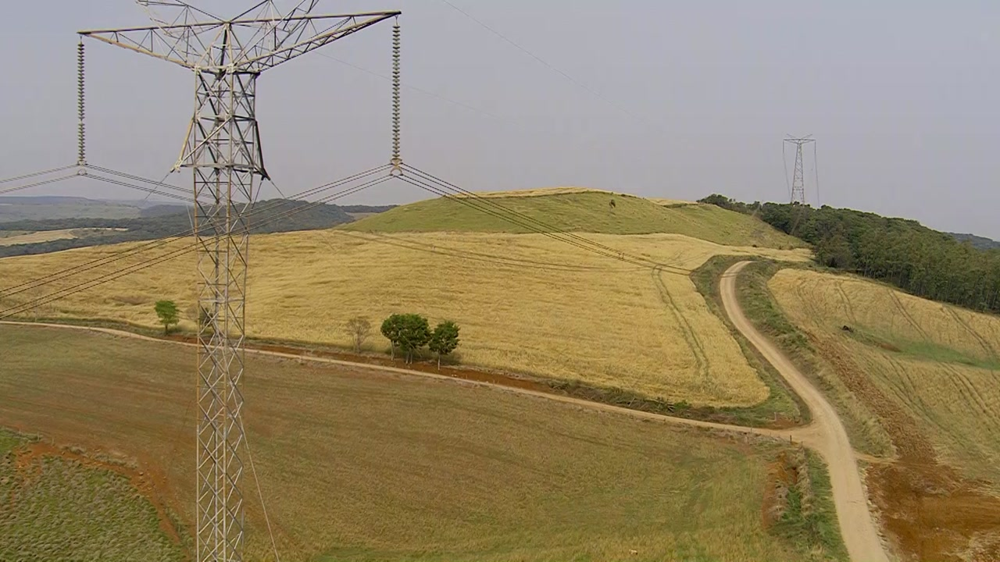
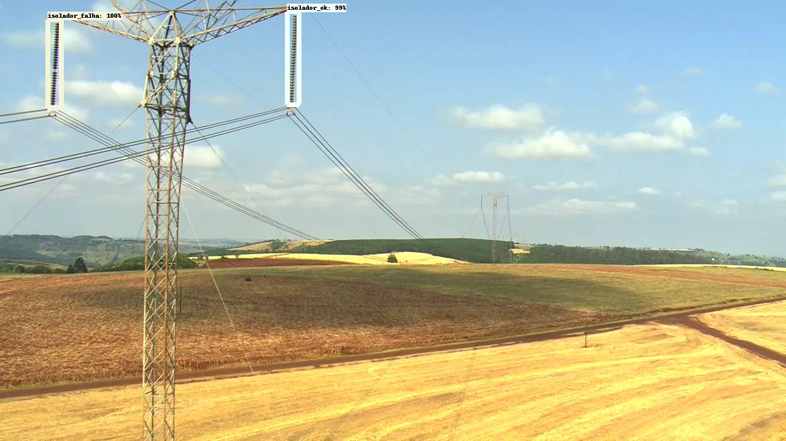
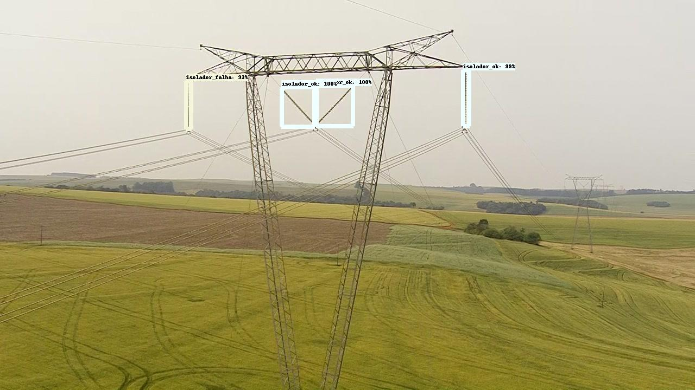
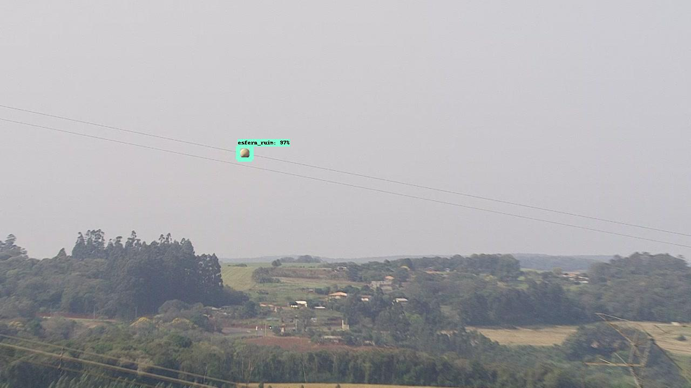
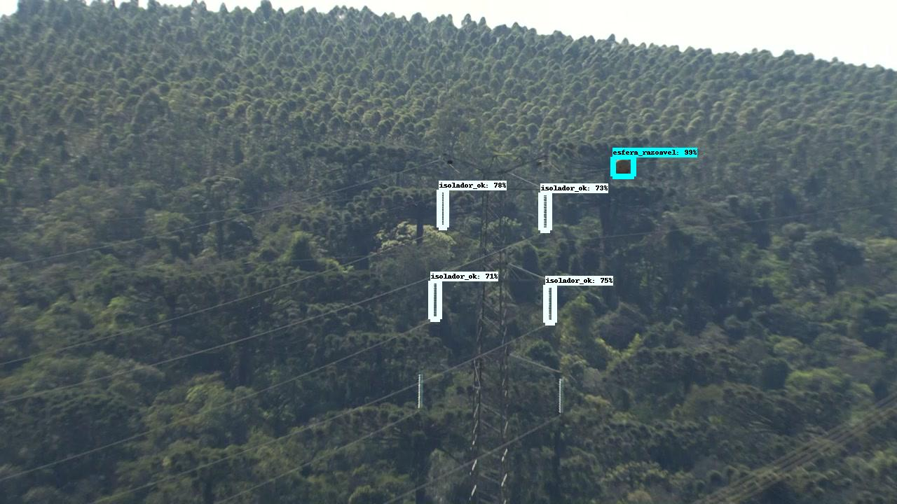
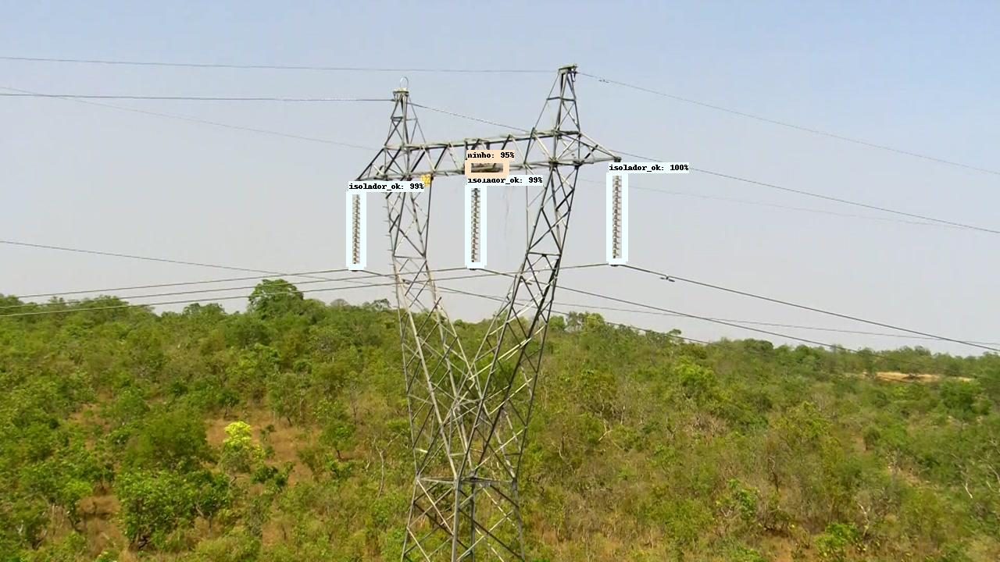

# Fault Detection Power Transmission Lines

This repo is a tutorial for training and evaluating the Tensorflow Object Detection API for fault detection at power transmission lines.



The following steps will be presented regarding the workflow of an object detection project:
- Requirements Installation
- Create the Environment using Docker
- Preprocess
- Create the pipeline config file
- Training
- Exporting your Trained Model do Frozen Graph
- Inference
- Auto-Annotating Images

## NVidia Driver
Nvidia drivers must be installed. Do a search in the official Nvidia documentation for your card. For example, to install a driver for a Tesla card, follow [this tutorial](https://docs.nvidia.com/datacenter/tesla/tesla-installation-notes/index.html).

## Requirements Installation

To install the Tensorflow Object detection API, it is necessary to install some basic requirements beforehand.

```buildoutcfg
$ apt-get update && apt-get install -y \
    protobuf-compiler \
    python3-pip \
    python3-pil \
    python3-lxml \
    python3-opencv
```

```buildWhen starting the training process, information will be displayed at each step, like the example below:outcfg
$ pip install tf_slim
```

And, most importantly, you need to install tensorflow:

```buildoutcfg
$ pip install tensorflow-gpu==2.7.0
```

### Tensorflow Object Detection API Installation

A detailed tutorial on installing the runtime environment can be found in the [official documentation](https://tensorflow-object-detection-api-tutorial.readthedocs.io/en/latest/install.html).

```buildoutcfg
$ pip install pycocotools
```

```buildoutcfg
$ cd /
$ git clone --depth 1 https://github.com/tensorflow/models
```

```buildoutcfg
$ cd /models/research/
$ protoc object_detection/protos/*.proto --python_out=.
```

```buildoutcfg
$ cp /models/research/object_detection/packages/tf2/setup.py /models/research
$ cd /models/research/
$ python -m pip install .
```
Testing the installation:

```buildoutcfg
$ cd /content/models/research/
$ python object_detection/builders/model_builder_tf2_test.py
```

```
Ran 24 tests in 20.478s

OK (skipped=1)
```
## Create the Environment using Docker

An alternative to performing the manual installation is to create the entire runtime using Docker.

First, considering you already have the nvidia driver installed, you will need to install the docker. I recommend following [this tutorial](https://docs.nvidia.com/ai-enterprise/deployment-guide/dg-docker.html). After installing Docker, just run the following commands.

To build our image run:

```
$ docker build -t tensorflow_object_detection ./
```

To run container from the image use command:

```
$ docker run --name tf2od -p 8888:8888 -d tensorflow_object_detection
```

## Download Dataset

After downloading the **Furnas Dataset**, unzip the dataset in the "data" folder.  You can verify that it has the following organization format:

```
├─ furnas_dataset_v0.01/
│  └─ imgs
│       └─train
│           └─ image_1.jpg
│           └─ image_2.jpg
│           └─ ...
│           └─ image_n.jpg
│       └─test
│           └─ image_1.jpg
│           └─ image_2.jpg
│           └─ ...
│           └─ image_n.jpg  
|  train.csv
|  test.csv
```
Therefore, consider the following variables:

```
$ INPUT_TRAIN_FOLDER='./data/furnas_dataset_v0.01/imgs/train'
$ INPUT_TEST_FOLDER='./data/furnas_dataset_v0.01/imgs/test'
$ TRAIN_CSV_FILEPATH='./data/furnas_dataset_v0.01/train.csv'
$ TEST_CSV_FILEPATH='./data/furnas_dataset_v0.01/test.csv'
```

## Default Configuration

The default configuration is in the file **data/parameters.yaml**, named as PARAMETER_CONFIG_YAML_FILE. All the scripts use this file. The following is a description of the variables present in this file
 
#### Dataset
- **input_train_img_folder**: folder containing training images.
- **input_test_img_folder**: folder containing testing images.
- **input_train_csv**: csv training file path.
- **input_test_csv**: csv testing file path.
- **train_record_path**: path in which the training tfrecord file generated by the "generate_tfrecord.py" script will be written.
- **test_record_path**: path in which the testing tfrecord file generated by the "generate_tfrecord.py" script will be written.
- **labelmap_path**: path of the label map file, present in the dataset folder.
- **num_classes**: number of classes present in the dataset.

#### Model
- **model_name**: name of the model to be trained. Must be available in the utils/models_links.py.
- **checkpoint_save_path**: "checkpoints"
- **pipeline_config_filepath**: folder in which checkpoints will be saved.
- **batch_size**: number of images per training batch. It depends on the GPU used.
- **use_data_aug**: If True, the script preprocess.py perform date augmentation on the training inagens. Otherwise, it uses only the images present in the dataset.

## Preprocess

The pre-processing consists of performing data augmentation on some selected images. In the file there is also a function, called select_data, which selects which images will be augmented. 

There is a script already configured via file that uses the [imgaug library](https://imgaug.readthedocs.io/en/latest/). To perform the preprocessing, run the command: 

```
$ python preprocess.py \
    --config_file=PARAMETER_CONFIG_YAML_FILE \
    --input_folder=INPUT_TRAIN_FOLDER \
    --output_folder=OUTPUT_TRAIN_AUG_FOLDER \
    --input_csv=TRAIN_CSV_FILEPATH \
    --image_extension='.jpg' \
    --aug_per_file=2 \
    --resize \
    --new_shape=(1024,1024)
```

If you prefer to follow the settings in the PARAMETER_CONFIG_YAML_FILE file, just run:

```
$ python preprocess.py \
    --config_file=PARAMETER_CONFIG_YAML_FILE 
```

## TFRecord Files

**Furnas Dataset** has two files that contain the annotations: "train.csv" and "test.csv". For training the models, it is necessary to convert them to the tfrecord format. To do this, run the following command:

```
$ python generate_tfrecord.py \
    --config_file=PARAMETER_CONFIG_YAML_FILE \
    --input_train_csv=TRAIN_CSV_FILEPATH \
    --input_test_csv=TEST_CSV_FILEPATH \
    --images_train_dir=INPUT_TRAIN_FOLDER \
    --images_test_dir=INPUT_TEST_FOLDER \
    --output_train_tfrecord=OUTPUT_TRAIN_TFRECORD_FILEPATH \
    --output_test_tfrecord=OUTPUT_TEST_TFRECORD_FILEPATH 
```

If you prefer to follow the settings in the PARAMETER_CONFIG_YAML_FILE file, just run:

```
$ python generate_tfrecord.py \
    --config_file=PARAMETER_CONFIG_YAML_FILE 
```

## Create Pipeline Config

to train the chosen model, it is necessary to download the package containing the checkpoints and the pipeline file, and edit the pipeline file. This is done automatically, by running the command: 
```
$ python create_auto_config.py \
    --config_file=PARAMETER_CONFIG_YAML_FILE \
    --model_name=SELECTED_MODEL_NAME \
    --finetune_checkpoint=PIPELINE_AUTOCONFIG_FILEPATH \
    --batch_size=BATCH_SIZE
```


In this way, a PIPELINE_AUTOCONFIG_FILEPATH file will be created containing the entire training pipeline.

If you prefer to follow the settings in the PARAMETER_CONFIG_YAML_FILE file, just run:

```
$ python create_auto_config.py \
    --config_file=PARAMETER_CONFIG_YAML_FILE 
```

## Training

Assuming everything went well during the requirements installation, to do the training on **Furnas Dataset**, just run the following command:

```
$ python train.py \
    --config_file=PARAMETER_CONFIG_YAML_FILE \
    --checkpoint_save_path=CHECKPOINTS_FOLDER \
    --pipeline_file=PIPELINE_AUTOCONFIG_FILEPATH \
    --checkpoint_every_n=CHECKPOINTS_STEPS \
    --num_train_steps=TRAIN_STEPS \
    --num_workers=NUM_WORKS
```
When starting the training process, information will be displayed at each step, like the example below:
```
INFO:tensorflow:Step 100 per-step time 1.938s
I1223 23:31:42.470360 140361518614400 model_lib_v2.py:707] Step 100 per-step time 1.938s
INFO:tensorflow:{'Loss/classification_loss': 0.82733643,
 'Loss/localization_loss': 0.5610607,
 'Loss/regularization_loss': 0.7503873,
 'Loss/total_loss': 2.1387844,
 'learning_rate': 0.1666635}
I1223 23:31:42.473480 140361518614400 model_lib_v2.py:708] {'Loss/classification_loss': 0.82733643,
 'Loss/localization_loss': 0.5610607,
 'Loss/regularization_loss': 0.7503873,
 'Loss/total_loss': 2.1387844,
 'learning_rate': 0.1666635}
 ```

## Exporting your Trained Model do Frozen Graph

Exporting the model to a Frozen Graph file is the best option if you want to continue training, perform inference or use it as a subgraph. To export the trained model, run the following command:

```
$ python export.py \
    --config_file=PARAMETER_CONFIG_YAML_FILE \
    --pipeline_config_file=PIPELINE_AUTOCONFIG_FILEPATH \
    --checkpoint_dir=CHECKPOINTS_FOLDER \
    --output_export_dir=EXPORTED_CHECKPOINTS_DIR
```

If you prefer to follow the settings in the PARAMETER_CONFIG_YAML_FILE file, just run:

```
$ python export.py \
    --config_file=PARAMETER_CONFIG_YAML_FILE 
```

In this way, the model will be exported to the output folder, generating the following folder structure:
```
├─ EXPORTED_CHECKPOINTS_DIR/
│  └─ checkpoint/
│  └─ saved_model
│  └─ pipeline.config
└─ ...
```
Now your model is ready to perform the inference process.

## Running Inference

From a trained and exported model, you can perform inference and detect fault in your own images using the following command:

```
$ python inference.py \
    --config_file=PARAMETER_CONFIG_YAML_FILE \
    --checkpoint_dir=EXPORTED_CHECKPOINTS_DIR \
    --image_path=SOURCE_IMAGES_DIR \
    --label_map=LABEL_MAP_FILE \
    --output_dir=OUTPUT_IMAGES_DIR
```

If you prefer to follow the settings in the PARAMETER_CONFIG_YAML_FILE file, just run:

```
$ python inference.py \
    --config_file=PARAMETER_CONFIG_YAML_FILE 
```


Below is an example image of the result:











## Evaluating

From a trained model, it is possible to perform its evaluation using the following script. 


```
$ python evaluation.py \
    --config_file=PARAMETER_CONFIG_YAML_FILE \
    --checkpoint_dir=EXPORTED_CHECKPOINTS_DIR \
    --pipeline_config_file=PIPELINE_AUTOCONFIG_FILEPATH \
    --save_dir=EVAL_RESULT_FOLDER
```

This way, the model will be evaluated based on the test set images, and the result will be saved in the folder EVAL_RESULT_FOLDER.  


## Auto-Annotating Images

You can use a pre-trained model, with an early version of the dataset, to produce more annotated images for model training. Of course, just these annotated images will not contribute to learning the model. This tool aims to facilitate the data annotation step, as it will produce the bounding-boxes, classifying them. Therefore, automatically annotated images must still be validated or corrected manually.

To generate annotations in xml format, run the following command:

```
$ python annotate.py \
    --config_file=PARAMETER_CONFIG_YAML_FILE \
    --checkpoint_dir=EXPORTED_CHECKPOINTS_DIR \
    --image_path=SOURCE_IMAGES_DIR \
    --label_map=LABEL_MAP_FILE \
    --output_dir=OUTPUT_XML_DIR
```

Thus, for each image present in the SOURCE_IMAGES_DIR directory, a corresponding XML file will be created in the OUTPUT_XML_DIR directory.

```
├─ SOURCE_IMAGES_DIR/
│  └─ image_1.jpg
│  └─ image_2.jpg
│  └─ ...
│  └─ image_n.jpg
│  
├─ OUTPUT_XML_DIR/
│  └─ image_1.xml
│  └─ image_2.xml
│  └─ ...
│  └─ image_n.xml
```

To view the annotations, copy the images to the same directory as the xml files and use the LabelImg program.

```buildoutcfg
$ labelImg
```
Click "Open Dir" and choose the directory containing the images and annotations:


If you need to export annotations to another format (eg COCO or YOLO), check the "tools" folder which contains some conversion scripts.

## References

- [TensorFlow 2 Object Detection API tutorial](https://tensorflow-object-detection-api-tutorial.readthedocs.io/en/latest/index.html)
- [How to train your own Object Detector with TensorFlow’s Object Detector API](https://towardsdatascience.com/how-to-train-your-own-object-detector-with-tensorflows-object-detector-api-bec72ecfe1d9)
- [TensorFlow 2 — Object Detection on Custom Dataset with Object Detection API](https://medium.com/swlh/image-object-detection-tensorflow-2-object-detection-api-af7244d4c34e)
- [PASCAL VOC Writer: A python library for generating annotations in the PASCAL VOC format.](https://github.com/AndrewCarterUK/pascal-voc-writer)

## Copyright

See [LICENSE](https://github.com/freds0/object_detection_capybara/blob/main/LICENSE) for details. Copyright (c) 2021 Fred Oliveira.
transmission_lines